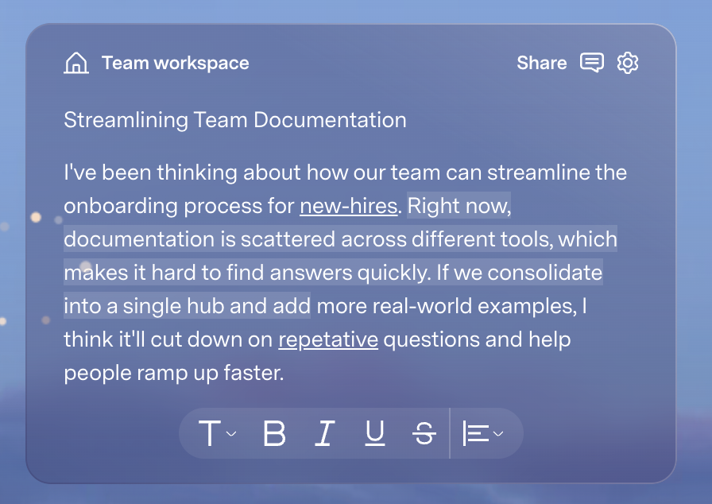

# Private Presenter Teleprompter for macOS

## 1. Product summary

Build a small native macOS teleprompter that displays a lecture script in a dark, opaque, always-on-top window over Keynote's full-screen Presenter Display.

The lecturer sees the teleprompter on the Mac's private display. Students see only the Keynote slideshow on the external projector or classroom display.

The app does not control Keynote or synchronize text to individual slides in version 1. Keynote continues to control the presentation normally. The teleprompter independently scrolls one continuous lecture script while remaining visible above Keynote.

## Visual reference

Use this screenshot as the primary visual reference for the overlay's proportions, rounded container, restrained blue palette, typography, header treatment, text spacing, subtle line highlighting, and floating pill-shaped toolbar. Do not copy the screenshot's wording or collaboration-specific actions.

The screenshot has a translucent glass appearance. The teleprompter must reproduce that appearance with an **opaque** dark blue surface, subtle gradients, borders, and highlights. Content behind the panel must not show through because it could reduce lecture-script readability.

## 2. Primary objective

Let a lecturer read a long script comfortably while presenting a Keynote slideshow, without showing the script to students and without interrupting normal slide controls.

## 3. Target platform

- Native macOS application
- Swift and SwiftUI for the editor and settings
- AppKit `NSPanel` or an equivalent AppKit window for the teleprompter overlay
- Target modern Apple Silicon Macs
- Minimum supported macOS version: macOS 14, unless a newer minimum is required for reliable full-screen overlay behavior
- No Electron or browser-based wrapper for version 1

## 4. Presentation environment

The intended physical setup is:

- The Mac and projector use **extended display mode**, not display mirroring.
- Keynote displays its full-screen Presenter Display on the Mac.
- Keynote displays the audience slideshow on the projector.
- The teleprompter overlay appears only on the Mac's display.
- The teleprompter must never automatically create a window on the projector display.

True display mirroring is not supported because mirrored displays show identical pixels.

## 5. Core user flow

1. The user opens the teleprompter app.
2. A controller/editor window appears.
3. The user pastes or types a lecture script.
4. The app automatically saves the current script locally.
5. The user clicks **Open Teleprompter**.
6. The app chooses the Mac's built-in display by default. If no built-in display exists, it asks the user to select a display.
7. A dark, opaque teleprompter panel appears on the selected display.
8. The user moves and resizes the panel, then locks it.
9. The user starts Keynote in full-screen presentation mode.
10. The teleprompter remains visible above Keynote's Presenter Display.
11. The user controls Keynote normally with Space, arrow keys, clicks, or a presentation remote.
12. The user controls teleprompter scrolling with global shortcuts that work while Keynote remains active.
13. At the end of the lecture, the user hides or closes the teleprompter.

## 6. Teleprompter overlay requirements

### Visual appearance

- Overall aesthetic: a refined dark blue macOS panel modeled on the visual reference above
- Background: opaque dark navy with a subtle vertical gradient, approximately `#34466F` at the top to `#202B4B` at the bottom
- Background opacity: 100%
- Content behind the panel must never be visible through the reading surface
- Outer border: 1 pt white at approximately 20% opacity
- Corner radius: approximately 28 pt
- Optional restrained outer shadow for separation from Keynote; avoid a bright glow
- Text: white or very light gray, approximately `#F7F8FC`
- Default font: SF Pro or the macOS system sans-serif
- Default text alignment: left aligned
- Default font size: 42 pt
- Comfortable line spacing of approximately 1.35–1.5 suitable for reading aloud
- Generous internal padding of approximately 44–52 pt
- No standard macOS title bar, traffic-light buttons, scrollbar, or ordinary window chrome
- Text outside the panel must be clipped
- Scrolling should be visually smooth, without line-by-line jumping

### Header treatment

- Include a compact header inside the rounded panel, matching the reference image.
- Left side: a simple teleprompter/document icon followed by the current script title. Default title: **Lecture Teleprompter**.
- Right side: compact icon buttons for Start/Pause, Lock/Unlock, and Settings.
- Use white line icons with consistent optical sizing and generous click targets.
- Keep the header visually quiet so it does not compete with the lecture text.
- In Focus Mode, the header fades out after two seconds without pointer movement and returns when the pointer enters the panel or the user unlocks it.

### Reading text and active-line treatment

- The script occupies the main central area beneath the header.
- Maintain a comfortable line length similar to the visual reference; do not stretch text edge to edge on wide screens.
- Provide an optional active reading band around the vertical reading position.
- The active reading band should use a subtle desaturated-blue rectangular highlight behind approximately two or three lines, inspired by the selected text treatment in the reference.
- The highlight must not reduce contrast or resemble the macOS text-selection color.
- Previously read and upcoming text may remain fully visible. Do not dim them so aggressively that the user loses context.
- Underlines shown in the reference are content formatting and should not be added automatically.

### Floating quick-controls toolbar

- Add a centered pill-shaped toolbar near the bottom of the panel, visually based on the reference image.
- Suggested controls: font size, text weight, text alignment, slower, Start/Pause, and faster.
- Use a subtly lighter blue surface, rounded capsule corners, white icons, and thin dividers.
- Buttons must have tooltips and accessibility labels.
- The toolbar is visible while the panel is unlocked.
- In locked Focus Mode, the toolbar fades out after two seconds and returns on pointer hover or when the user unlocks the panel.
- The toolbar must not overlap the active reading band or obscure the final lines of the script; reserve bottom padding for it.

### Default placement

- Open near the top center of the Mac's built-in display so the reader's eyes remain relatively close to the camera and audience sightline.
- Default width: approximately 70% of the selected display
- Default height: approximately 35% of the selected display
- The user can resize and reposition the panel while it is unlocked.
- The app remembers the panel's position and size per display.
- Preserve the rounded-card proportions from the visual reference where possible, while allowing free resizing.

### Window behavior

- Always stays above Keynote's Presenter Display, including when Keynote is full screen.
- Appears in the same macOS full-screen Space as Keynote.
- Remains pinned to the user-selected display.
- Must not appear on the external audience/projector display.
- Must not force Keynote out of full-screen mode.
- Must not steal keyboard focus from Keynote when locked.
- In locked mode, mouse clicks pass through the panel to Keynote underneath it.
- In unlocked mode, the user can move, resize, and configure the panel using the custom header and quick-controls toolbar.
- The panel can be hidden and restored with a global shortcut.
- The panel should recover safely if a display is disconnected during use.

### Suggested AppKit configuration

The implementation should begin with a borderless, non-activating `NSPanel` and validate the exact combination on the target macOS version. Expected behaviors include:

- A floating or appropriate elevated window level
- `canJoinAllSpaces`
- `fullScreenAuxiliary`, or the current AppKit equivalent that permits an overlay to join another application's full-screen Space
- Non-activating panel behavior
- Mouse-event ignoring when locked

The final implementation must be tested over an actual full-screen Keynote Presenter Display. Merely appearing above an ordinary desktop window is not sufficient.

## 7. Script controls

The controller/editor window must provide:

- Multiline script editor
- Open Teleprompter / Close Teleprompter
- Start / Pause
- Restart from beginning
- Scroll-speed control
- Font-size control
- Text alignment control: left or center
- Active reading-band toggle
- Focus Mode toggle
- Lock / Unlock panel
- Display selector
- Hide / Show panel
- Clear script, with confirmation

### Scrolling behavior

- Scrolling is time based and smooth.
- Speed can be changed while scrolling.
- Pausing preserves the exact reading position.
- Restart returns to the beginning and pauses.
- Manual movement forward or backward must be possible while paused or playing.
- Reaching the end automatically pauses scrolling.
- Editing the script should not unexpectedly reset the reading position unless the text before the current position materially changes.

## 8. Global keyboard shortcuts

The shortcuts must work while Keynote is the active application and should not require the teleprompter panel to take focus.

Default shortcuts:

| Action | Shortcut |
| --- | --- |
| Start or pause scrolling | Control-Option-Space |
| Increase speed | Control-Option-Up Arrow |
| Decrease speed | Control-Option-Down Arrow |
| Move backward | Control-Option-Left Arrow |
| Move forward | Control-Option-Right Arrow |
| Hide or show teleprompter | Control-Option-H |
| Lock or unlock panel | Control-Option-L |

Shortcuts should be configurable if practical. The implementation should avoid intercepting Keynote's normal Space and arrow-key controls.

Prefer a global-hotkey implementation that does not require Accessibility permission. If macOS permission is unavoidable, explain why in the interface and request it only when needed.

## 9. Settings and persistence

Persist locally between launches:

- Current script
- Reading position
- Scroll speed
- Font size
- Text alignment
- Selected display when it still exists
- Panel size and position per display
- Locked/unlocked state
- Custom keyboard shortcuts, if implemented

No account, cloud synchronization, analytics, or network connection is required.

## 10. Privacy and audience safety

- All script content remains local on the Mac.
- The app makes no network requests.
- The app must clearly show which display contains the overlay.
- If macOS display mirroring is enabled, show a visible warning in the controller: **Display mirroring is on. Students may see the teleprompter. Use Extended Display mode.**
- If the selected private display and Keynote's audience display cannot be distinguished reliably, warn the user instead of guessing silently.

The app cannot guarantee privacy if the user shares or records the entire private Mac display using third-party conferencing or capture software. The primary guarantee in version 1 is physical-display placement in extended-display mode.

## 11. Menu bar behavior

The app may use a menu bar item for quick access. At minimum, it should provide:

- Show Controller
- Start / Pause
- Show / Hide Teleprompter
- Lock / Unlock
- Quit

Closing the controller window should not quit the app while the teleprompter is active.

## 12. Error and edge-case handling

- **External display disconnected:** Move the overlay safely to the built-in display, pause scrolling, and notify the user.
- **Selected display no longer exists:** Fall back to the built-in display and require confirmation before resuming.
- **Mirroring enabled:** Warn prominently that private-display behavior is not possible.
- **Keynote not running:** The teleprompter should still work over any application.
- **Keynote enters or exits full screen:** The overlay remains available and does not get stranded in another Space.
- **App relaunched after a crash:** Restore the script and settings, but start paused.
- **Very long script:** The editor and scrolling must remain responsive for at least 50,000 words.
- **Empty script:** Disable Start and show a simple instruction to paste or type a script.

## 13. Accessibility

- Full keyboard operation for the controller
- VoiceOver labels for all controls
- Adjustable text size of at least 24–96 pt
- High contrast by default
- Respect Reduce Motion where practical while preserving readable scrolling
- Do not rely on color alone to communicate locked, paused, or warning states

## 14. Version 1 acceptance criteria

Version 1 is complete only when all of the following have been manually verified:

1. Connect a projector or second display and disable mirroring.
2. Start a Keynote presentation with the audience slideshow on the projector and Presenter Display on the Mac.
3. Open the teleprompter on the Mac's display.
4. Confirm that the teleprompter remains visible above the full-screen Keynote Presenter Display.
5. Confirm that no part of the teleprompter appears on the projector.
6. Lock the panel and verify that Keynote retains focus.
7. Use Space, arrow keys, and a presentation remote to advance Keynote normally.
8. Start, pause, change speed, move backward, move forward, and hide the teleprompter using global shortcuts.
9. Confirm that scrolling is smooth and resumes from the exact paused position.
10. Disconnect and reconnect the external display without losing the script or crashing.
11. Quit and reopen the app and confirm that the script and settings are restored, with scrolling paused.
12. Enable display mirroring and confirm that the app warns the user.
13. Compare the running overlay with `references/teleprompter-ui-reference.png` and verify the dark blue rounded panel, internal header, typography, line spacing, active reading treatment, and bottom pill toolbar are recognizably consistent with the reference.
14. Confirm that the panel is fully opaque even over a bright Keynote Presenter Display.
15. Enable Focus Mode and confirm that the header and bottom toolbar fade away, then return when the panel is unlocked or hovered.

## 15. Out of scope for version 1

- Importing or parsing Keynote presenter notes
- Detecting the current Keynote slide
- Automatically changing script sections when slides change
- Controlling Keynote
- PowerPoint integration
- iPhone, iPad, Windows, or web versions
- Cloud storage or collaboration
- Accounts or authentication
- AI writing or script generation
- Audio-based automatic pacing
- Eye tracking
- Recording or broadcasting

These can be considered only after the overlay is proven reliable during a real lecture.

## 16. Recommended implementation sequence

1. Create the native macOS project and basic script editor.
2. Implement the AppKit overlay panel.
3. Prove the overlay stays above Keynote's full-screen Presenter Display.
4. Prove the overlay can be restricted to the Mac's display.
5. Add smooth scrolling and controls.
6. Add global keyboard shortcuts without stealing Keynote focus.
7. Add lock/click-through mode.
8. Add persistence and display-change recovery.
9. Add mirroring detection and warnings.
10. Run the complete acceptance test with a real external display and Keynote.

The full-screen Keynote overlay proof should happen before investing in interface polish.

## 17. Definition of the final reading experience

During a lecture, the user sees a polished, dark blue, completely opaque rounded panel containing large light-colored text that scrolls smoothly. Its visual language matches `references/teleprompter-ui-reference.png`: restrained blue gradients, a fine light border, spacious typography, an optional subtle active-reading highlight, a compact internal header, and a floating pill-shaped controls toolbar. Focus Mode hides the header and toolbar when they are not needed. The overlay stays above Keynote's full-screen Presenter Display, remains on the private Mac display, and does not interfere with advancing the presentation. Students see only the normal Keynote slideshow on the projector.
